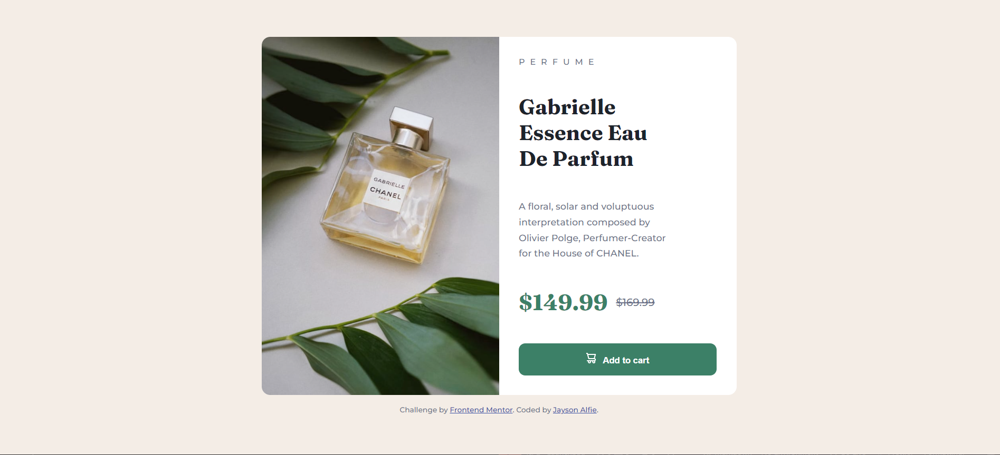

# Frontend Mentor - Product preview card component solution

This is a solution to the [Product preview card component challenge on Frontend Mentor](https://www.frontendmentor.io/challenges/product-preview-card-component-GO7UmttRfa).Frontend Mentor challenges help you improve your coding skills by building realistic projects. 

## Table of contents

- [Overview](#overview)
  - [The challenge](#the-challenge)
  - [Screenshot](#screenshot)
  - [Links](#links)
- [My process](#my-process)
  - [Built with](#built-with)
  - [Useful resources](#useful-resources)
- [Author](#author)

## Overview

### The challenge

Users should be able to:

- View the optimal layout depending on their device's screen size
- See hover and focus states for interactive elements

### Screenshot

### Links
- Solution URL : [https://github.com/jaysonalfie/Product-Preview-Card-Component.git](https://github.com/jaysonalfie/Product-Preview-Card-Component.git)
- Live Site URL : [https://product-preview-card-component-three-ruddy.vercel.app/](https://product-preview-card-component-three-ruddy.vercel.app/)

## My process
I was able to use React together with Vite to create the webpage and delved more into the mobile first approach as I was trying to achieve responsivity.This was an upgrade from using CRA that I was using before. I created a page component and Vanilla css was used for styling of the component.

### Built with
- Semantic HTML5 markup
- CSS custom properties
- [React](https://reactjs.org/) - JS library
- [Vite](https://vitejs.dev/) - Code bundler

## Resources
- [MDN Docs](https://developer.mozilla.org/en-US/)
- [React](https://reactjs.org/)
- [Vite](https://vitejs.dev/)

## Author
- Github - [Jaysonalfie](https://github.com/jaysonalfie)
- Frontend mentor - [Jaysonalfie](https://www.frontendmentor.io/profile/jaysonalfie)